<h1 align="center">Hello!I am Yury, <a href="https://yourunb.github.io/WelcomePortfolio/">Frontend developer</a>.</h1>

<h2>↘️ About me:</h2>

   
   
   

<h2>↘️ Skills:</h2>

   
   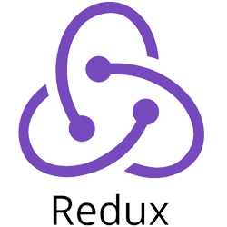
   
   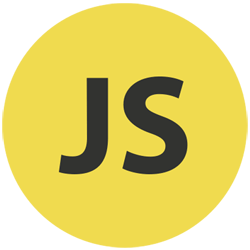
   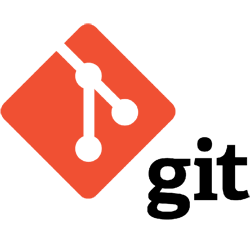
   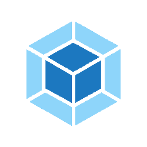
   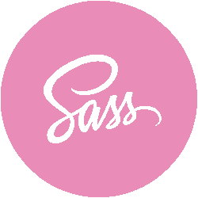
   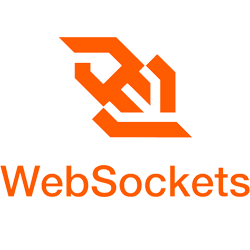
   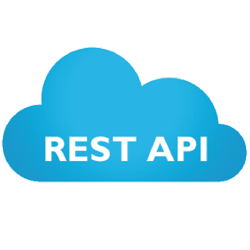
   
   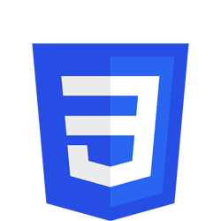
   
   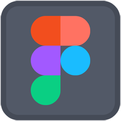
   
   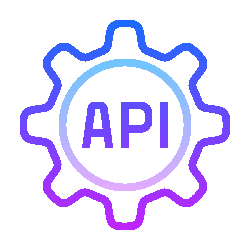
   
   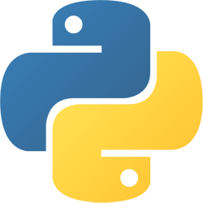
   
   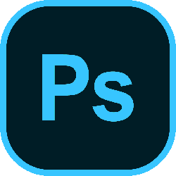

<h2>↘️ My Projects:</h2>

   <h4><a href="https://rolling-scopes-school.github.io/yourunb-JSFE2023Q4/rss-puzzle/">Puzzle Game</a></h4>
   Description: SPA for learn English fun 
   Stack: <strong>TypeScript, JavaScript, Webpack, Drag&Drop, Fetch, HTML, CSS, JSON, Git, REST, LocalStorage, esLint, Prettier, Husky, Animation, SPA</strong> 

   <h4><a href="https://rolling-scopes-school.github.io/yourunb-JSFE2023Q4/fun-chat/">Chat</a></h4>
   Description: chat for communication is implemented on webSocket (<a href="https://github.com/YourunB/fun-chat-server">API</a> for work app) 
   Stack: <strong>WebSocket, TypeScript, JavaScript, Webpack, SessionStorage, Git, HTML, SASS, esLint, Prettier, Husky, Animation, SPA</strong> 
   
   <h4><a href="https://yourunb.github.io/FinalSpace/">Final Space React App</a></h4>
   Description: React SPA about Final Space movie 
   Stack: <strong>React, Redux, Firebase, Fetch, REST, JavaScript, LocalStorage, Git, HTML, CSS, API, JSON, Animation, SPA</strong> 
   
   <h4><a href="https://yourunb.github.io/Nonograms-Game/">Nonograms Game</a></h4>
   Description: Japanese Crosswords - logic puzzles 
   Stack: <strong>TypeScript, JavaScript, Webpack, Fetch, LocalStorage, Git, HTML, CSS, JSON, esLint, Prettier, Husky, Animation, SPA</strong> 
   
   <h4><a href="https://yourunb.github.io/Free-To-Play/">Free To Play</a></h4>
   Description: SPA designed in accordance with MVC is an application for searching for free games 
   Stack: <strong>JavaScript, Firebase, MVC, Fetch, LocalStorage, REST, Git, HTML, CSS, API, JSON, Animation, SPA</strong> 

   <h4><a href="https://yourunb.github.io/CoffeeHouse/">Coffee House</a></h4>
   Description: Web site about coffee and tea 
   Stack: <strong>JavaScript, Figma, Fetch, JSON, LocalStorage, Git, HTML, Animation, CSS</strong> 

   <h4><a href="https://yourunb.github.io/Rick-and-Morty-on-React/">Rick and Morty React App</a></h4>
   Description: React SPA about Rick and Morty movie 
   Stack: <strong>React, Redux, Firebase, Fetch, JavaScript, REST, Git, HTML, SASS(SCSS), Animation, SPA</strong> 

   <h4><a href="https://rolling-scopes-school.github.io/yourunb-JSFE2023Q4/async-race/">Async Race</a></h4>
   Description: car racing, asynchronous programming (<a href="https://github.com/YourunB/async-race-api">API</a> for work app) 
   Stack: <strong>TypeScript, Webpack, JavaScript, REST, HTML, CSS, LocalStorage, esLint, Prettier, Husky, Animation, SPA</strong> 

   <h4><a href="https://rolling-scopes-school.github.io/yourunb-JSFE2023Q4/news-api/">News</a></h4>
   Description: SPA fo show news 
   Stack: <strong>TypeScript, JavaScript, Webpack, Git, REST, HTML, CSS, esLint, Prettier, Husky, Animation, SPA</strong> 
   
   <h4><a href="https://yourunb.github.io/Memory-Game/Memory-Game/">Game Train Brain</a></h4>
   Description: Games for developing the memory abilities of our brain 
   Stack: <strong>JavaScript, HTML, CSS, LocalStorage, Git, Animation, SPA</strong> 
   
   <h4><a href="https://yourunb.github.io/Image-Gallery/image-gallery/">Image Gallery</a></h4>
   Description: Applications for viewing images and current new photos every day 
   Stack: <strong>JavaScript, Fetch, Git, HTML, CSS, API, Animation, SPA</strong> 

   <h4><a href="https://yourunb.github.io/Hangman-Game/">Hangman Game</a></h4>
   Description: A bright and exciting quiz game - hangman. 
   Stack: <strong>JavaScript, HTML, CSS, Git, esLint, Prettier, Husky, Animation, SPA</strong> 
   
   <h4><a href="https://yourunb.github.io/Rick_and_Morty/">Rick And Morty</a></h4>
   Description: Applications for viewing information about all the characters of the cartoon Rick and Morty 
   Stack: <strong>JavaScript, AJAX, HTML, CSS, Git, API, Animation, SPA</strong> 

   <h4><a href="https://yourunb.github.io/kapibara-lab/">Kapibara Lab</a></h4>
   Description: React App about kapibara laboratory 
   Stack: <strong>React, Webpack, Figma, Git, JavaScript, HTML, SASS, esLint, Prettier, Husky</strong> 

   <h4><a href="https://yourunb.github.io/real-estate/">Real Estate</a></h4>
   Description: Web site about real estate company 
   Stack: <strong>JavaScript, HTML, CSS, Git, Animation, esLint, Prettier, Husky</strong> 
   
   <h4><a href="https://yourunb.github.io/Audio-Player/">Music Player</a></h4>
   Description: Stylized audio player 
   Stack: <strong>JavaScript, HTML, CSS, Git, Animation</strong> 
   
   <h4><a href="https://yourunb.github.io/WheatherPlugin/">Wheather Plugin</a></h4>
   Description: Embedded weather plugin for any website 
   Stack: <strong>JavaScript, Fetch, Git, MVC, Animation, HTML, CSS</strong> 

   <h4><a href="https://yourunb.github.io/NYC-Library/">NYC Library</a></h4>
   Description: Educational project from the figma about the NYC Library 
   Stack: <strong>JavaScript, Figma, Git, HTML, CSS</strong> 

   <h4><a href="https://yourunb.github.io/earn-money/">Earn money</a></h4>
   Description: Landing for earn money 
   Stack: <strong>TypeScript, Figma, Webpack, JavaScript, Git, esLint, Prettier, Husky, HTML, SASS</strong> 

   <h4><a href="https://yourunb.github.io/test-routing/">Routing SPA in Github</a></h4>
   Description: This is my test application with fully implemented routing for SPA on Github without using any third party libraries. 
   Stack: <strong>TypeScript, JavaScript, Webpack, SPA, Git, esLint, Prettier, Husky, HTML, SASS</strong> 

   <h4><a href="https://yourunb.github.io/PingPong/">Ping Pong</a></h4>
   Description: Ping pong game made on canvas 
   Stack: <strong>JavaScript, Canvas, Animation, HTML, CSS</strong> 

   <h4><a href="https://yourunb.github.io/creative-images/image1">Creative images</a></h4>
   Description: Images about realt company 
   Stack: <strong>JavaScript, HTML, CSS, Git</strong> 
   
   <h4><a href="https://yourunb.github.io/First_project-stretch_ceilings/">Stretch Ceilings</a></h4>
   Description: Web site about stretch ceilings 
   Stack: <strong>jQuery, JavaScript, Git, Animation, HTML, CSS</strong> 
   
   <h4><a href="https://yourunb.github.io/WelcomePortfolio/">Welcome Portfolio</a></h4>
   Description: Creative welcome portfolio 
   Stack: <strong>JavaScript, HTML, CSS, Git, Animation, SPA</strong> 
   
   <h4><a href="https://yourunb.github.io/CV/">Curriculum Vitae</a></h4>
   Description: My CV 
   Stack: <strong>JavaScript, Drag&Drop, Git, esLint, Prettier, Husky, HTML, CSS</strong> 

   <h4><a href="https://yourunb.github.io/cssMemeSlider/">Meme Slider</a></h4>
   Description: Slider in pure HTML and CSS 
   Stack: <strong>HTML, CSS, Animation</strong> 

   <h4><a href="https://codepen.io/BxYura/pens/public">more projects...</a></h4>

   

   <h2>↘️ CodeWars:</h2>
   

  <h2>↘️ CodePen: </h2>
  

<h2>↘️ IT certificates:</h2>
<h4> IT Academy (duration: 3 month) - <a href="https://yourunb.github.io/CV/assets/img/fd3.jpg">Web application development using React</a> (score: 10 / 10)</h4>
<h4> IT Academy (duration: 3 month) - <a href="https://yourunb.github.io/CV/assets/img/fd2.jpg">Web application development with JavaScript</a> (score: 10 / 10)</h4>
<h4> IT Academy (duration: 3 month) - <a href="https://yourunb.github.io/CV/assets/img/fd1.jpg">Website development with HTML, CSS & JavaScript</a> (score: 10 / 10)</h4>
<h4> Amazon Web Services (duration: 1 week) - <a href="https://yourunb.github.io/CV/assets/img/AWS-1.jpg">Getting Started with Cloud Acquisition</a></h4>
<h4> Microsoft (duration: 2 week) - <a href="https://learn.microsoft.com/en-gb/users/yury-1685/achievements/yvhj45er">Build JavaScript applications using TypeScript</h4>
<h4> RS School (duration: 5 month) - <a href="https://app.rs.school/certificate/v2s8zsd2">JavaScript / Frontend. Pre-School</a> (score: 1125.7 / 1135)</h4>
<h4> RS School (duration: 9 month) - <a href="https://app.rs.school/certificate/v2s8zsd2">JavaScript / Frontend. Stage 1 & Stage 2</a> (in progress)</h4>

<h2>↘️ IT courses:</h2>

   
   
   
   
   

