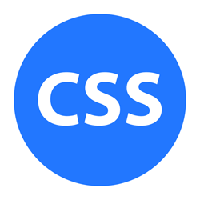

<h1 align="center">Hello!I am Yury, <a href="https://yourunb.github.io/WelcomePortfolio/">Front-End developer</a>.</h1>

<h2>📝 About me: </h2>

   
   
   

<h2>⚡ Skills:</h2>

   
   
   
   
   
   
   
   
   
   
   
   
   
   
   
   
   
   

   <h2>💡 My Projects:</h2>
   <h4><a href="https://rolling-scopes-school.github.io/yourunb-JSFE2023Q4/rss-puzzle/">Puzzle Game</a></h4>
   Description: SPA for learn English fun 
   Stack: <strong>TypeScript, Fetch, Webpack, HTML, CSS, JSON, Drag&Drop, LocalStorage, SPA</strong> 
   
   <h4><a href="https://yourunb.github.io/FinalSpace/">Final Space React App</a></h4>
   Description: React SPA about Final Space movie 
   Stack: <strong>React, Redux, Fetch, JavaScript, HTML, CSS, API, JSON, LocalStorage, Firebase, SPA</strong> 
   
   <h4><a href="https://yourunb.github.io/Nonograms-Game/">Nonograms Game</a></h4>
   Description: Japanese Crosswords - logic puzzles 
   Stack: <strong>TypeScript, Webpack, Fetch, HTML, CSS, JSON, LocalStorage, SPA</strong> 
   
   <h4><a href="https://yourunb.github.io/Free-To-Play/">Free To Play</a></h4>
   Description: SPA designed in accordance with MVC is an application for searching for free games 
   Stack: <strong>JavaScript, Fetch, MVC, HTML, CSS, API, JSON, LocalStorage, SPA, Firebase</strong> 

   <h4><a href="https://yourunb.github.io/CoffeeHouse/">Coffee House</a></h4>
   Description: Web site about coffee and tea 
   Stack: <strong>JavaScript, Figma, Fetch, JSON, LocalStorage, HTML, CSS</strong> 

   <h4><a href="https://yourunb.github.io/Rick-and-Morty-on-React/">Rick and Morty React App</a></h4>
   Description: React SPA about Rick and Morty movie 
   Stack: <strong>React, Redux, Fetch, JavaScript, HTML, SASS(SCSS), Firebase, SPA</strong> 

   <h4><a href="https://rolling-scopes-school.github.io/yourunb-JSFE2023Q4/news-api/">News</a></h4>
   Description: SPA fo show news 
   Stack: <strong>TypeScript, Webpack, HTML, CSS, SPA</strong> 
   
   <h4><a href="https://yourunb.github.io/Memory-Game/Memory-Game/">Game Train Brain</a></h4>
   Description: Games for developing the memory abilities of our brain 
   Stack: <strong>JavaScript, HTML, CSS, LocalStorage, SPA</strong> 
   
   <h4><a href="https://yourunb.github.io/Image-Gallery/image-gallery/">Image Gallery</a></h4>
   Description: Applications for viewing images and current new photos every day 
   Stack: <strong>JavaScript, Fetch, HTML, CSS, API, SPA</strong> 

   <h4><a href="https://yourunb.github.io/Hangman-Game/">Hangman Game</a></h4>
   Description: A bright and exciting quiz game - hangman. 
   Stack: <strong>JavaScript, HTML, CSS, SPA</strong> 
   
   <h4><a href="https://yourunb.github.io/Rick_and_Morty/">Rick And Morty</a></h4>
   Description: Applications for viewing information about all the characters of the cartoon Rick and Morty 
   Stack: <strong>JavaScript, AJAX, HTML, CSS, API, SPA</strong> 

   <h4><a href="https://yourunb.github.io/real-estate/">Real Estate</a></h4>
   Description: Web site about real estate company 
   Stack: <strong>JavaScript, HTML, CSS, Animation</strong> 
   
   <h4><a href="https://yourunb.github.io/Audio-Player/">Music Player</a></h4>
   Description: Stylized audio player 
   Stack: <strong>JavaScript, HTML, CSS</strong> 
   
   <h4><a href="https://yourunb.github.io/WheatherPlugin/">Wheather Plugin</a></h4>
   Description: Embedded weather plugin for any website 
   Stack: <strong>JavaScript, Fetch, MVC, HTML, CSS</strong> 

   <h4><a href="https://yourunb.github.io/NYC-Library/">NYC Library</a></h4>
   Description: Educational project from the figma about the NYC Library 
   Stack: <strong>JavaScript, Figma, HTML, CSS</strong> 

   <h4><a href="https://yourunb.github.io/PingPong/">Ping Pong</a></h4>
   Description: Ping pong game made on canvas 
   Stack: <strong>JavaScript, Canvas, HTML, CSS</strong> 
   
   <h4><a href="https://yourunb.github.io/First_project-stretch_ceilings/">Stretch Ceilings</a></h4>
   Description: Web site about stretch ceilings 
   Stack: <strong>jQuery, JavaScript, HTML, CSS</strong> 
   
   <h4><a href="https://yourunb.github.io/WelcomePortfolio/">Welcome Portfolio</a></h4>
   Description: Creative welcome portfolio 
   Stack: <strong>JavaScript, HTML, CSS, SPA</strong> 
   
   <h4><a href="https://yourunb.github.io/CV/">Curriculum Vitae</a></h4>
   Description: My CV 
   Stack: <strong>JavaScript, Drag&Drop, HTML, CSS</strong> 

   <h4><a href="https://yourunb.github.io/cssMemeSlider/">Meme Slider</a></h4>
   Description: Slider in pure HTML and CSS 
   Stack: <strong>HTML, CSS</strong> 

   <h4><a href="https://codepen.io/BxYura/pens/public">more projects...</a></h4>

  <h2>🔥 CodeWars:</h2>
  

  

  <h2>🛠️ CodePen: </h2>
  

<h2>🎓 Studied IT courses:</h2>

   
   
   
   

