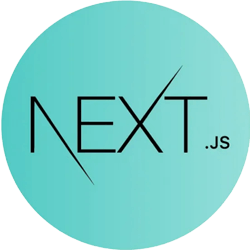
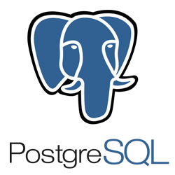
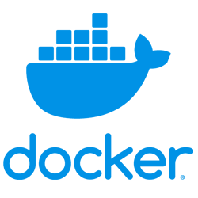

<h1 align="center">&#60;Hello World /&#62;  I am <a href="https://yourunb.github.io/CV/">Frontend Developer</a></h1>

<h2>↘️ About me:</h2>

   
   
   

<h2>↘️ Skills:</h2>

   
   
   
   
   
   
   
   
   
   
   
   
   
   
   
   
   
   
   

<h2>↘️ My Projects:</h2>

   <h4><a href="https://времена-года-кмв.рф">Vremena Goda</a></h4>
   Description: Next App about tourist tours 
   Stack: <strong>Next, PostgreSQL, Docker, CI/CD, Yandex.Cloud, Yookassa, TypeScript, JavaScript, HTML, Tailwind, Git, esLint, Prettier, Husky</strong> 
   
   <h4><a href="https://mirteam.netlify.app/">Mirteam</a></h4>
   Description: Website about stretch ceilings in Moscow 
   Stack: <strong>TypeScript, JavaScript, HTML, CSS, Git, esLint, Prettier</strong> 
   
   <h4><a href="https://rolling-scopes-school.github.io/yourunb-JSFE2023Q4/rss-puzzle/">Puzzle Game</a></h4>
   Description: A fun app for learning English 
   Stack: <strong>TypeScript, JavaScript, Webpack, Drag&Drop, Fetch, HTML, CSS, JSON, Git, REST, LocalStorage, esLint, Prettier, Husky, Animation, SPA</strong> 

   <h4><a href="https://yourunb.github.io/pokemon/">Pokemon</a></h4>
   Description: Application about pokemons with <a href="https://pokeapi.co/">pokeAPI</a> v2 
   Stack: <strong>React, Redux, RTK Query, TypeScript, JavaScript, Vite, HTML, SASS, Git, REST, LocalStorage, esLint, Prettier, FSD, MUI</strong> 
   
   <h4><a href="https://yourunb.github.io/Free-To-Play/">Free To Play</a></h4>
   Description: SPA designed in accordance with MVC is an application for searching for free games 
   Stack: <strong>JavaScript, Firebase, MVC, Fetch, LocalStorage, REST, Git, HTML, CSS, API, JSON, Animation, SPA</strong> 
   
   <h4><a href="https://graphiql-app-theta.vercel.app/en">Graph/Rest Client</a> - created with my team (<a href="https://github.com/yourunb">Yury</a> - team lead / frontend, <a href="https://github.com/Lilo002">Liza</a> - frontend, <a href="https://github.com/valeryaosta">Valerya</a> - frontend)</h4>
   Description: Graph/Rest Client App created on Next JS 
   Stack: <strong>Next, GraphQL, REST, TypeScript, JavaScript, Vite, Vitest, App Router, Fetch, HTML, CSS, Git, esLint, Prettier, Husky</strong> 
   
   <h4><a href="https://yourunb.github.io/disney-charcters-redux-RTK/">Disney Characters</a> with RTK Query</h4>
   Description: React SPA with <a href="https://disneyapi.dev/">Disney API</a> + Redux 
   Stack: <strong>React, Redux, RTK Query, React Router + Outlet, TypeScript, JavaScript, Vite, Vitest, Jest, Pagination, Fetch, HTML, CSS, Git, REST, esLint, Prettier, Husky, SPA</strong> 

   <h4><a href="https://rolling-scopes-school.github.io/yourunb-JSFE2023Q4/fun-chat/">Chat</a> with WebSocket + for work backend <a href="https://github.com/YourunB/fun-chat-server">API</a></h4>
   Description: chat for communication is implemented on webSocket (<a href="https://github.com/YourunB/fun-chat-server"><b>API</b></a> for work app) 
   Stack: <strong>WebSocket, TypeScript, JavaScript, Webpack, SessionStorage, Git, HTML, SASS, Fetch, esLint, Prettier, Husky, Animation, SPA</strong> 
   
   <h4><a href="https://yourunb.github.io/FinalSpace/">Final Space React App</a></h4>
   Description: React SPA about Final Space movie 
   Stack: <strong>React, Redux, Vite, Firebase, Fetch, REST, JavaScript, LocalStorage, Git, HTML, CSS, API, JSON, Animation, SPA</strong> 
   
   <h4><a href="https://yourunb.github.io/Nonograms-Game/">Nonograms Game</a></h4>
   Description: Japanese Crosswords - logic puzzles 
   Stack: <strong>TypeScript, JavaScript, Webpack, Fetch, LocalStorage, Git, HTML, CSS, JSON, esLint, Prettier, Husky, Animation, SPA</strong> 

   <h4><a href="https://yourunb.github.io/CoffeeHouse/">Coffee House (Сreated From Figma)</a></h4>
   Description: Web site about coffee and tea 
   Stack: <strong>JavaScript, Figma, Fetch, JSON, LocalStorage, Git, HTML, Animation, CSS</strong> 

   <h4><a href="https://yourunb.github.io/Rick-and-Morty-on-React/">Rick and Morty React App</a></h4>
   Description: React SPA about Rick and Morty movie 
   Stack: <strong>React, Redux, Vite, Firebase, Fetch, JavaScript, REST, Git, HTML, SASS(SCSS), Animation, SPA</strong> 

   <h4><a href="https://yourunb.github.io/kids-store/">Kids Store (Сreated From Figma)</a></h4>
   Description: Web site about kids cloth 
   Stack: <strong>JavaScript, jQuery Figma, Swiper, FancyBox, Git, HTML, CSS, Bootstrap</strong> 

   <h4><a href="https://rolling-scopes-school.github.io/yourunb-JSFE2023Q4/async-race/">Async Race</a> + for work backend <a href="https://github.com/YourunB/async-race-api">API</a></h4>
   Description: car racing, asynchronous programming (<a href="https://github.com/YourunB/async-race-api"><b>API</b></a> for work app) 
   Stack: <strong>TypeScript, Webpack, JavaScript, REST, HTML, CSS, LocalStorage, esLint, Prettier, Husky, Animation, SPA</strong> 

   <h4><a href="https://yourunb.github.io/disney-charcters-react-spa/">Disney Characters</a></h4>
   Description: React SPA with <a href="https://disneyapi.dev/">Disney API</a> 
   Stack: <strong>React, React Router, TypeScript, JavaScript, Vite, Vitest, Jest, Pagination, Fetch, HTML, CSS, Git, REST, LocalStorage, esLint, Prettier, Husky, SPA</strong> 

   <h4><a href="https://yourunb.github.io/ATRE/">ATRE (Сreated From Figma)</a></h4>
   Description: Web site about ATRE 
   Stack: <strong>jQuery, JavaScript, Figma, CSS, HTML</strong> 

   <h4><a href="https://rolling-scopes-school.github.io/yourunb-JSFE2023Q4/ecommerce/">Plants Shop</a> - created with my team (<a href="https://github.com/yourunb">Yury</a> - team lead / frontend, <a href="https://github.com/k98940">Kostya</a> - frontend, <a href="https://github.com/timoshenkovanadya">Nadya</a> - frontend)</h4>
   Description: this is final project for team work from education Stage 2 in <a href="https://rs.school/">RS School</a> (course duration 9 month) 
   Stack: <strong>TypeScript, JavaScript, Webpack, REST, API Commerce Tools, Swiper, Trello, HTML, SASS, LocalStorage, SessionStorage, Git, Fetch, esLint, Prettier, Husky, Jest, Routing, Animation, SPA, Agile(Scrum)</strong> 

   <h4><a href="https://rolling-scopes-school.github.io/yourunb-JSFE2023Q4/news-api/">News</a></h4>
   Description: SPA fo show news 
   Stack: <strong>TypeScript, JavaScript, Webpack, Git, REST, HTML, CSS, esLint, Prettier, Husky, Animation, SPA</strong> 
   
   <h4><a href="https://yourunb.github.io/Memory-Game/Memory-Game/">Game Train Brain</a></h4>
   Description: Games for developing the memory abilities of our brain 
   Stack: <strong>JavaScript, HTML, CSS, LocalStorage, Git, Animation, SPA</strong> 
   
   <h4><a href="https://yourunb.github.io/Image-Gallery/image-gallery/">Image Gallery</a></h4>
   Description: Applications for viewing images and current new photos every day 
   Stack: <strong>JavaScript, Fetch, Git, HTML, CSS, API, Animation, SPA</strong> 

   <h4><a href="https://yourunb.github.io/Hangman-Game/">Hangman Game</a></h4>
   Description: A bright and exciting quiz game - hangman. 
   Stack: <strong>JavaScript, HTML, CSS, Git, esLint, Prettier, Husky, Animation, SPA</strong> 

   <h4>Rick and Morty Next App</h4>
   Version: 
   - Rick and Morty on <a href="https://github.com/YourunB/React-Tasks/tree/nextjs-ssr-app-router-api">Next.js App Router API</a> 
   - Rick and Morty on <a href="https:remix-ssr">Next.js Remix SSR</a> 
   - Rick and Morty on <a href="https://github.com/YourunB/React-Tasks/tree/nextjs-ssr-pages-api">Next.js SSR Pages API</a> 
   Description: SPA about movie Rick and Morty create on Next with <a href="https://rickandmortyapi.com/">API</a> 
   Stack: <strong>Next, Redux, RTK Query, Vite, TypeScript, JavaScript, HTML, CSS, Jest, Vitest, Husky, Prettier, esLint</strong> 
   
   <h4><a href="https://yourunb.github.io/Rick_and_Morty/">Rick And Morty</a></h4>
   Description: Applications for viewing information about all the characters of the cartoon Rick and Morty 
   Stack: <strong>JavaScript, AJAX, HTML, CSS, Git, API, Animation, SPA</strong> 

   <h4><a href="https://yourunb.github.io/kapibara-lab/">Kapibara Lab (Сreated From Figma)</a></h4>
   Description: React App about kapibara laboratory 
   Stack: <strong>React, Vite, Figma, Git, JavaScript, HTML, SASS, esLint, Prettier, Husky</strong> 

   <h4><a href="https://yourunb.github.io/company-projects/">Company projects</a></h4>
   Description: Landing for company projects 
   Stack: <strong>JavaScript, HTML, CSS, Git, Animation, esLint, Prettier, Husky</strong> 

   <h4><a href="https://yourunb.github.io/real-estate/">Real Estate</a></h4>
   Description: Web site about real estate company 
   Stack: <strong>JavaScript, HTML, CSS, Git, Animation, esLint, Prettier, Husky</strong> 
   
   <h4><a href="https://yourunb.github.io/Audio-Player/">Music Player</a></h4>
   Description: Stylized audio player 
   Stack: <strong>JavaScript, HTML, CSS, Git, Animation</strong> 
   
   <h4><a href="https://yourunb.github.io/WheatherPlugin/">Wheather Plugin</a></h4>
   Description: Embedded weather plugin for any website 
   Stack: <strong>JavaScript, Fetch, Git, MVC, Animation, HTML, CSS</strong> 

   <h4><a href="https://yourunb.github.io/NYC-Library/">NYC Library (Сreated From Figma)</a></h4>
   Description: Educational project from the figma about the NYC Library 
   Stack: <strong>JavaScript, Figma, Git, HTML, CSS</strong> 

   <h4><a href="https://yourunb.github.io/earn-money/">Earn money (Сreated From Figma)</a></h4>
   Description: Landing for earn money 
   Stack: <strong>TypeScript, Figma, Webpack, JavaScript, Git, esLint, Prettier, Husky, HTML, SASS</strong> 

   <h4><a href="https://yourunb.github.io/test-routing/">Routing SPA in Github</a></h4>
   Description: This is my test application with fully implemented routing for SPA on Github without using any third party libraries. 
   Stack: <strong>TypeScript, JavaScript, Webpack, SPA, Git, esLint, Prettier, Husky, HTML, SASS</strong> 

   <h4><a href="https://yourunb.github.io/Forms-With-Yup/">Forms Validate</a></h4>
   Description: React SPA with validate forms by Yup (React Hook Form & Uncontrolled Form) 
   Stack: <strong>React, Redux, RTK, TypeScript, Vite, JavaScript, HTML, CSS, Routing, Prettier, Husky, esLint, Yup</strong> 

   <h4><a href="https://yourunb.github.io/residential-complex/">Residential Complex (Сreated From Figma)</a></h4>
   Description: Project was made according to figma 
   Stack: <strong>HTML, CSS, JS, Prettier, Lite Server, Figma</strong> 

   <h4><a href="https://yourunb.github.io/binance-chart/">Binance Diagram BTC/USDT</a></h4>
   Description: Project with Binance API for create diagram 
   Stack: <strong>React, TypeScript, Vite, esLint, Prettier, HTML, CSS, Victory Chart</strong> 

   <h4><a href="https://yourunb.github.io/adaptive-menu">Adaptive menu</a></h4>
   Description: Test task for create adaptive menu for all devices 
   Stack: <strong>JavaScript, HTML, CSS, Git, prettier, esLint</strong> 

   <h4><a href="https://yourunb.github.io/PingPong/">Ping Pong</a></h4>
   Description: Ping pong game made on canvas 
   Stack: <strong>JavaScript, Canvas, Animation, HTML, CSS</strong> 

   <h4><a href="https://yourunb.github.io/creative-images/image1">Creative images</a></h4>
   Description: Images about realt company 
   Stack: <strong>JavaScript, HTML, CSS, Git</strong> 

   <h4><a href="https://yourunb.github.io/houses-floor-clip-poligon/">Test Clip Mask Poligon</a></h4>
   Description: Test about clip mask in CSS 
   Stack: <strong>HTML, CSS, Git</strong> 
   
   <h4><a href="https://yourunb.github.io/First_project-stretch_ceilings/">Stretch Ceilings</a></h4>
   Description: Web site about stretch ceilings 
   Stack: <strong>jQuery, JavaScript, Git, Animation, HTML, CSS</strong> 

   <h4><a href="https://yourunb.github.io/custom-validation-form/">Test Custom Validation</a></h4>
   Description: Test custom validation form on native js with SASS, created with webpack 
   Stack: <strong>Webpack, JavaScript, Git, Animation, HTML, SASS</strong> 
   
   <h4><a href="https://yourunb.github.io/WelcomePortfolio/">Welcome Portfolio</a></h4>
   Description: Creative welcome portfolio 
   Stack: <strong>JavaScript, HTML, CSS, Git, Animation, SPA</strong> 
   
   <h4><a href="https://yourunb.github.io/CV/">Curriculum Vitae</a></h4>
   Description: My CV 
   Stack: <strong>JavaScript, Drag&Drop, Git, esLint, Prettier, Husky, HTML, CSS</strong> 

   <h4><a href="https://yourunb.github.io/React-Tasks/class-components/">Application</a> on class components</h4>
   Description: React App with Disney API 
   Stack: <strong>React, TypeScript, JavaScript, Vite, Fetch, HTML, CSS, Git, REST, esLint, Prettier, Husky, SPA</strong> 

   <h4><a href="https://yourunb.github.io/cssMemeSlider/">Meme Slider</a></h4>
   Description: Slider in pure HTML and CSS 
   Stack: <strong>HTML, CSS, Animation</strong> 

   <h4><a href="https://yourunb.github.io/helpik/">HelpiK</a> & <a href="https://yourunb.github.io/OT/">OT</a></h4>
   Description: app to help doctors study medical tests and pass exams & app for studying occupational safety theory 
   Stack: <strong>HTML, JS, CSS</strong> 

   <h4>React mini tasks: <a href="https://yourunb.github.io/React-Tasks/class-components/">Disney</a>, <a href="https://yourunb.github.io/Works_on_React/user-list">List</a>, <a href="https://yourunb.github.io/Works_on_React/Filter/">Filter</a>, <a href="https://yourunb.github.io/Works_on_React/rainbow/">Rainbow</a></h4>
   Description: Some of mini task projets 
   Stack: <strong>React, Redux, Webpack, JS, CSS, Git</strong>

   <h4><a href="https://codepen.io/BxYura/pens/public">more projects...</a></h4>

   

   <h2>↘️ CodeWars:</h2>
   

  <h2>↘️ CodePen: </h2>
  

<h2>↘️ IT certificates:</h2>
<h4> RS School (duration: 3 month) - <a href="https://app.rs.school/certificate/xqvecs0c">React / Next. Stage 3</a> (score: 	1117.8 / 1195 - position: 45 / 1442)</h4>
<h4> RS School (duration: 9 month) - <a href="https://app.rs.school/certificate/i38wx6lp">JavaScript / Frontend. Stage 1 & Stage 2</a> (score: 4747.9 / 4828 - position: 13 / 5886)</h4>
<h4> RS School (duration: 5 month) - <a href="https://app.rs.school/certificate/v2s8zsd2">JavaScript / Frontend. Pre-School</a> (score: 1125.7 / 1135 - position: 83 / 8355)</h4>

   
   
   

<h4> IT Academy (duration: 3 month) - <a href="https://yourunb.github.io/CV/assets/img/fd3.jpg">Web application development using React</a> (score: 10 / 10)</h4>
<h4> IT Academy (duration: 4 month) - <a href="https://yourunb.github.io/CV/assets/img/fd2.jpg">Web application development with JavaScript</a> (score: 10 / 10)</h4>
<h4> IT Academy (duration: 3 month) - <a href="https://yourunb.github.io/CV/assets/img/fd1.jpg">Website development with HTML, CSS & JavaScript</a> (score: 10 / 10)</h4>

   
   
   

<h4> VK Education (duration: 2 month) - <a href="https://education.vk.company/curriculum/certificates/download/57773/a633d7e1-79d0-41bb-98cf-a501bc74ef47/">Algorithms and Data Structures</h4>
<h4> VK Education (duration: 4 month) - <a href="https://education.vk.company/curriculum/certificates/download/73869/bb1a6b6d-5990-42b9-863b-09162b620620/">Python</h4>
<h4> VK Education (duration: 2 week) - <a href="https://education.vk.company/curriculum/certificates/download/75257/53026b12-8068-4971-8e4a-6e4bcf73d5a7/">Product Management</h4>
<h4> VK Education (duration: 2 week) - <a href="https://education.vk.company/curriculum/certificates/download/78585/f7f0f580-a4aa-4987-9256-7235f6c812ad/">Information Security Basics</h4>

   
   
   
   

<h4> FreeCodeCamp (duration: 2 week) - <a href="https://www.freecodecamp.org/certification/yury-butskevich/responsive-web-design">Responsive Web Design</a></h4>
<h4> FreeCodeCamp (duration: 3 week) - <a href="https://www.freecodecamp.org/certification/yury-butskevich/data-visualization">Data Visualization</a></h4>
<h4> FreeCodeCamp (duration: 3 week) - <a href="https://www.freecodecamp.org/learn/javascript-algorithms-and-data-structures-v8/">JavaScript Algorithms and Data Structures</a></h4>

   
   
   

<h4> Stepik (duration: 1 month) - <a href="https://stepik.org/certificate/7780f759b9e7a1731f26ef9c1436d4aa8f969b87.pdf">Python for Beginners</h4>

   

<h4> Microsoft (duration: 2 week) - <a href="https://learn.microsoft.com/en-gb/users/yury-1685/achievements/yvhj45er">Build JavaScript applications using TypeScript</h4>

   

<h4> Amazon Web Services (duration: 1 week) - <a href="https://yourunb.github.io/CV/assets/img/AWS-1.jpg">Getting Started with Cloud Acquisition</a></h4>

   

<h2>↘️ IT courses:</h2>

   
   
   
   
   
   
   

